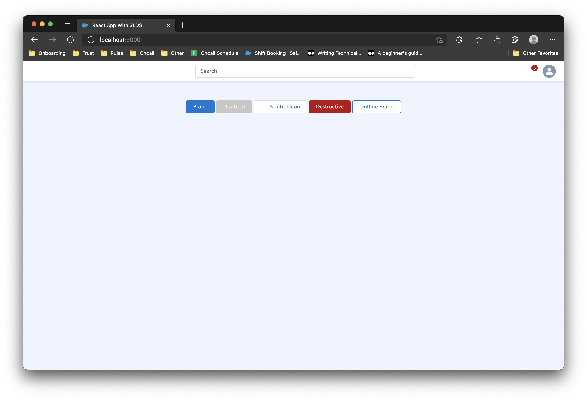

# cra-template-slds

This is a [Create React App template](https://github.com/facebook/create-react-app) with the Salesforce Lightning Design System ([SLDS](https://react.lightningdesignsystem.com/))

## Features

- Cleaner imports by using absolute imports ([doc](docs/features/AbsoluteImports.md))

## Requirements

- Node version >= 16

## Usage

To use this template, follow the steps below:

1. Create and initialize the app `my-app`:

   ```sh
   nvm use v16
   yarn create react-app my-app --template=slds
   ```
   or
   ```
   npx create-react-app my-app --template=slds
   ```

2. Setup SLDS:

   ```sh
   cd my-app
   yarn setup-slds
   ```

3. Run the app by running `yarn start`. It should open the browser on `localhost:3000` that looks like this:

   

## Development

To test your CRA template locally, run this command:

```sh
yarn create react-app my-app --template=slds --template file:<filepath to this repo>
```

where `filepath to this repo` is the file path to this template repo.

For instance,

```sh
yarn create react-app my-app --template=slds --template file:./cra-template-slds/
```

This will create a folder called `my-app` containing the React app with SLDS
